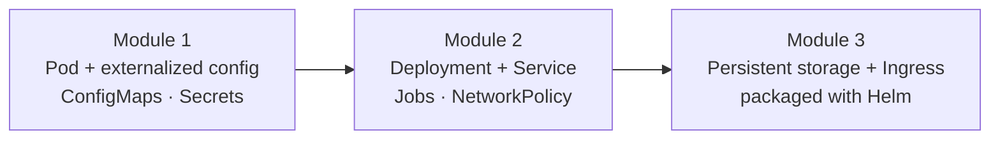

# CKAD Exam Prep Workshop — Cloud Native Dallas

> A hands-on CKAD workshop where the instructor demos it, you do the labs, and everything is built around **one application that evolves** — from a single Pod into a production-shaped, storage-backed, Ingress-fronted service.

This is the guided, live-troubleshooting layer that sits **on top of** a structured CKAD course
(KodeKloud / Mumshad's course) — not a replacement for it. You watch a concept demoed, repeat it
yourself, then deliberately **break it and fix it**, because diagnosing failures under time
pressure is what the exam actually rewards.



One app — **`checkout-api`** — is carried across every module. The labels and config you set early
(`app=checkout,tier=<role>`) become the thing a Service selects on later. That continuity is the
whole point: a sloppy label choice in Module 1 turns into a real, instructive outage in Module 2.

---

## Start here

| To find… | Go to |
|---|---|
| **When each module maps to a live session** | [SCHEDULE.md](SCHEDULE.md) |
| **Module 1 — the running scenario, prerequisites, agenda** | [01-pods-and-configuration/README.md](01-pods-and-configuration/README.md) |
| **Module 2 — workloads and networking** | [02-workloads-and-networking/README.md](02-workloads-and-networking/README.md) |

## Modules

Content is organized by **topic**, not by session number — [SCHEDULE.md](SCHEDULE.md) is the
single source of truth for how modules map onto live sessions, so the same material re-runs at any
cadence (3 sessions, 5 sessions, or a single all-day workshop) without restructuring.

| Module | Topics | Status |
|---|---|---|
| [`01-pods-and-configuration`](01-pods-and-configuration/README.md) | Pods, ConfigMaps, Secrets | **Available** |
| [`02-workloads-and-networking`](02-workloads-and-networking/README.md) | Multi-container Pods, Deployments, Jobs/CronJobs, Services, NetworkPolicies | **Available** |
| `03-storage-ingress-helm` | Ingress, Volumes/PVCs, Helm, exam strategy, mock exam | Planned |

Modules are published as they are built.

## How each lesson is structured

Every topic follows the same rhythm, so you always know what's coming:

1. **Instructor demo** — watch the concept built live from scratch.
2. **Guided / semi-guided repeat** — you do it, with hints tucked behind `<details>` if you get stuck.
3. **Break it / troubleshoot** — we intentionally apply a broken manifest and diagnose it together.
4. **Independent challenge** — a timed, exam-style task you solve on your own.
5. **Docs to search + homework** — the exact kubernetes.io pages to get fast at, plus practice labs.

## Prerequisites

- A working Kubernetes cluster you can reach with `kubectl` (KodeKloud playground, Docker Desktop,
  kind, minikube — anything where `kubectl get nodes` shows a `Ready` node).
- These handy exam-style shortcuts in your shell:
  ```bash
  alias k=kubectl
  export do='--dry-run=client -o yaml'   # generate manifests fast
  alias kn='kubectl config set-context --current --namespace'
  ```
- All manifests use only **public images** (`nginx`, `busybox`) and no cluster-specific features,
  so every example runs anywhere — not just on one vendor's playground.

## Connect

Built and facilitated by **Mithun Banerjee**. If you attended a session, want to run this for your
own community, or just want to talk Kubernetes and CKAD — connect with me:

**LinkedIn:** [https://www.linkedin.com/in/mbanerjee/](https://www.linkedin.com/in/mbanerjee/)

Feedback, issues, and PRs are welcome.

## License

Intended for release under the MIT License. Add a `LICENSE` file to make it official.
