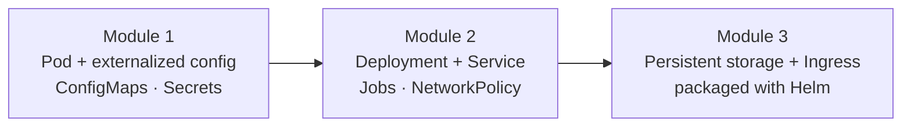

# CKAD Exam Prep Workshop — Cloud Native Dallas

> A hands-on CKAD workshop where the instructor demos it, you do the labs, and everything is built around **one application that evolves** from a single Pod into a production-shaped, storage-backed, Ingress-fronted service.

This is the guided, live-troubleshooting layer **on top of** KodeKloud's CKAD course — not a
replacement for it. You watch a concept demoed, repeat it yourself, then deliberately break
it and fix it, because diagnosing failures under time pressure is what the exam actually
rewards.

One app — `checkout-api` — carried across every module. The labels and config you set early
become the thing a Service selects on later. That continuity is the point.

---

## Start here

| To understand… | Read |
|---|---|
| **How the workshop works** — teaching method, the `checkout-api` story, module structure, prerequisites | [docs/how-it-works.md](docs/how-it-works.md) |
| **The CKAD exam** — format, scoring, domain weights, what's out of scope, resources | [docs/exam.md](docs/exam.md) |
| **Who's running it** | [docs/facilitator.md](docs/facilitator.md) |
| **When each module maps to a live session** | [SCHEDULE.md](SCHEDULE.md) |

## Modules

Content is organized by **topic**, not by session number — [SCHEDULE.md](SCHEDULE.md) is the
single source of truth for how modules map onto live sessions, so the same material re-runs
at any cadence without restructuring.

| Module | Topics | Status |
|---|---|---|
| [`01-pods-and-configuration`](01-pods-and-configuration/README.md) | Pods, ConfigMaps, Secrets | **Available** |
| `02-workloads-and-networking` | Multi-container Pods, Deployments, Jobs/CronJobs, Services, NetworkPolicies | Planned |
| `03-storage-ingress-helm` | Ingress, Volumes/PVCs, Helm, exam strategy | Planned |

Modules are published as they are built.

## License

Released under the [MIT License](LICENSE).
