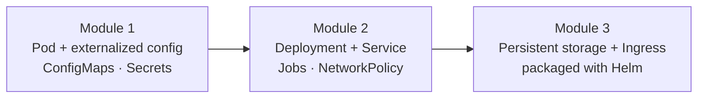

# How this workshop works

[← Back to overview](../README.md)

## Why it exists

Working through KodeKloud solo teaches you the syntax. It does not put you in a room where
something breaks live and you have to diagnose it under time pressure — which is exactly
what the exam, and the job, actually test.

This workshop is that missing layer. KodeKloud remains the primary content and the source
of repetition (the homework labs at the end of every module). The live sessions add what a
recorded course can't:

- **One guided rep per topic**, watched and corrected in real time.
- **Deliberate failure.** Every major topic includes a manifest that is broken on purpose,
  so you practice the `describe → Events → root cause → fix` loop instead of only ever
  seeing the happy path. Creating a resource correctly on the first try is not the skill
  the exam rewards; recovering from a `CreateContainerConfigError` in ninety seconds is.
- **A single evolving application** instead of disconnected `nginx1 / nginx2` snippets, so
  each concept builds on a decision you made in an earlier module.

## How each topic is taught

Every topic in every module follows the same five-beat pattern:

| Beat | What happens |
|---|---|
| 1. Instructor demo | One representative task — full command, YAML, and expected output. |
| 2. Guided / semi-guided repeat | You do a close variant yourself; the solution is hidden behind a collapsible block. |
| 3. Break / troubleshoot | A deliberately broken manifest. Observe the failure, name the cause, apply the fix. |
| 4. Independent challenge | Scenario and requirements only — you write it from scratch. |
| 5. KodeKloud homework | Named practice labs for the repetition that builds real muscle memory. |

## The running scenario: `checkout-api`

The whole workshop follows one application as it grows up.

- **It starts** as a bare Pod named `checkout-api`, with its configuration pulled out of
  the image into ConfigMaps and Secrets, labeled `app=checkout,tier=backend`.
- **It becomes resilient** — the same app, now a Deployment with multiple replicas, exposed
  through a Service that selects on the *exact labels you chose in Module 1*. Pick sloppy
  labels early and the Service silently matches zero pods later — a real CKAD failure mode,
  demonstrated on purpose.
- **It goes to production shape** — persistent storage for its database, an Ingress in
  front of it, and a Helm packaging pass to tie the lifecycle together.

The label decisions, the config externalization, the failure modes — each module inherits
consequences from the last.

## Module structure

Content is organized by **topic module**, not by a fixed session number.
[SCHEDULE.md](../SCHEDULE.md) is the single source of truth for how modules map onto actual
live sessions. This decoupling is deliberate: the same content runs as three 90-minute
community sessions, or at a different cadence for an internal re-run, without renaming or
restructuring anything.

| Module | Topics | Status |
|---|---|---|
| [`01-pods-and-configuration`](../01-pods-and-configuration/README.md) | Pods, ConfigMaps, Secrets | **Available** |
| `02-workloads-and-networking` | Multi-container Pods, Deployments, Jobs/CronJobs, Services, NetworkPolicies | Planned |
| `03-storage-ingress-helm` | Ingress, Volumes/PVCs, Helm, exam strategy | Planned |

Module dependency order

1. **`01-pods-and-configuration`** establishes the running `checkout-api` scenario and its
   label scheme (`app=checkout,tier=<role>`). Everything downstream depends on it.
2. **`02-workloads-and-networking`** requires Module 1 — its Services select on Module 1's
   labels.
3. **`03-storage-ingress-helm`** requires Modules 1 and 2.

## Prerequisites

- Basic container knowledge (images, containers, why config shouldn't be baked in).
- Comfort in a terminal.
- A [**KodeKloud CKAD course**](https://learn.kodekloud.com/learn/courses/certified-kubernetes-application-developer-ckad) or the [Udemy CKAD course](https://www.udemy.com/course/certified-kubernetes-application-developer/) — either gives you the practice labs; the KodeKloud free tier is enough to start.
- **A Kubernetes cluster you can run `kubectl` against.** Either a **local cluster** — Docker
  Desktop with Kubernetes enabled, kind, or minikube — or **any other cluster you already
  have access to**. Confirm it works with `kubectl get nodes` before the session.

Live sessions standardize everyone onto the **KodeKloud playground** specifically so that
when something breaks mid-session, the environment is identical across the room and the
troubleshooting stays consistent. The manifests and commands are cluster-agnostic, though —
they run unmodified on Docker Desktop, kind, minikube, KodeKloud, or any conformant cluster,
so a local setup works just as well for practice on your own time.

---

Next: [what the CKAD exam actually is →](exam.md)
